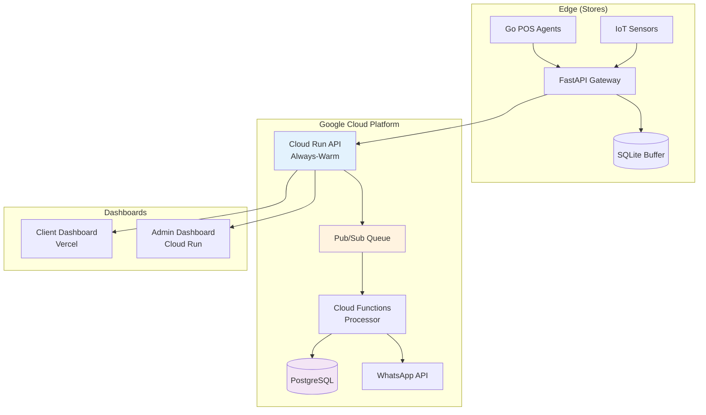

# StorePulse - Real-time Retail Monitoring Platform


[](docs/multi_tenant_implementation.md)
[](docs/architecture/)
[](docs/business/storepulse-mvp.md)

StorePulse is a comprehensive real-time monitoring platform designed for retail chains, providing edge-computing resilience with cloud-scale analytics. Monitor POS terminals, environmental sensors, and business operations across multiple store locations with intelligent alerting and centralized dashboards.

## 🎯 **Project Overview**

- **Scale**: 30 stores, ~150 POS terminals, ~240 environmental sensors
- **Traffic**: ~19.5K events/hour processing capacity  
- **Architecture**: Hybrid serverless (Cloud Run + Cloud Functions)
- **Multi-tenant**: Ready for multiple retail clients
- **Budget**: $265/month per client infrastructure cost

## 🏗️ **Architecture**



## 📁 **Project Structure**

```
storepulse-workspace/
├── services/                       # Backend services
│   ├── api/                       # Cloud Run API (FastAPI)
│   ├── gateway/                   # Edge Gateway (FastAPI + SQLite)
│   ├── pos-agent/                 # Windows POS Agent (Go)
│   └── functions/                 # Cloud Functions (Python)
├── frontend/                      # Dashboard applications  
│   ├── client-dashboard/          # React client dashboard
│   └── admin-dashboard/           # React admin dashboard
├── infrastructure/                # Infrastructure as Code
│   ├── terraform/                 # GCP infrastructure
│   ├── docker/                    # Container configurations
│   └── kubernetes/                # K8s manifests (future)
├── docs/                          # Documentation
│   ├── architecture/              # Technical architecture
│   ├── business/                  # Business requirements
│   └── development/               # Development guides
├── tools/                         # Operational tools
│   ├── onboarding/               # Tenant onboarding scripts
│   ├── monitoring/               # Health check tools
│   └── deployment/               # Deployment automation
└── .github/workflows/            # CI/CD pipelines
```

## 🚀 **Quick Start**

### Prerequisites
- Docker & Docker Compose
- Python 3.11+
- Go 1.21+ (for POS agent)
- Node.js 18+ (for dashboards)
- Google Cloud Account

### Development Setup
```bash
# Clone repository
git clone https://github.com/yourusername/storepulse-workspace.git
cd storepulse-workspace

# Start all services locally
docker-compose up -d

# Check service health
./tools/health-check.sh

# Access dashboards
open http://localhost:3000  # Client Dashboard
open http://localhost:3001  # Admin Dashboard
```

### Production Deployment
```bash
# Deploy to Google Cloud Platform
cd infrastructure/terraform
terraform init
terraform plan
terraform apply

# Deploy application services
./tools/deployment/deploy-production.sh
```

## 🏪 **Multi-Tenant Architecture**

StorePulse is built multi-tenant from day one:

- **Row Level Security**: Automatic data isolation by `tenant_id`
- **API Key Management**: Unique keys per store/tenant
- **Cost Monitoring**: Per-tenant usage tracking
- **Automated Onboarding**: 5-minute new client setup

```bash
# Onboard new client with 5 stores
python tools/onboarding/onboard_tenant.py \
    --tenant-id retailcorp \
    --company "Retail Corp" \
    --stores 5 \
    --email admin@retailcorp.com
```

[📖 **Multi-Tenant Implementation Guide**](docs/multi_tenant_implementation.md)

## 🛠️ **Technology Stack**

### Backend Services
- **API**: Python FastAPI + PostgreSQL + Pub/Sub
- **Gateway**: Python FastAPI + SQLite (edge resilience)
- **POS Agent**: Go (single binary, Windows service)
- **Functions**: Python (Cloud Functions Gen2)

### Frontend Applications
- **Client Dashboard**: React 18 + Vite + TailwindCSS
- **Admin Dashboard**: React 18 + Material-UI
- **Hosting**: Vercel (client) + Cloud Run (admin)

### Infrastructure
- **Cloud**: Google Cloud Platform (hybrid serverless)
- **Database**: PostgreSQL (Cloud SQL) with Row Level Security
- **Message Queue**: Pub/Sub for async processing
- **Monitoring**: Cloud Monitoring + structured logging

### DevOps
- **IaC**: Terraform for GCP resources
- **CI/CD**: GitHub Actions with path-based triggers
- **Containers**: Docker multi-stage builds
- **Security**: SAST, dependency scanning, secrets management

## 📊 **Key Features**

### Real-time Monitoring
- **POS Health**: <1 minute failure detection
- **Environmental**: Temperature/humidity monitoring every 5 minutes
- **Network**: Connectivity and peripheral status
- **Alerts**: WhatsApp Business API integration

### Edge Computing
- **Offline Operation**: 4+ hours without internet
- **Local Buffer**: SQLite with automatic sync
- **Intelligent Retry**: Exponential backoff reconnection
- **Zero Data Loss**: Guaranteed metric delivery

### Business Intelligence
- **Real-time Dashboards**: 30-second refresh cycles
- **Historical Analytics**: 1-year data retention
- **Alert Management**: Acknowledgment and resolution tracking
- **Cost Monitoring**: Infrastructure usage per tenant

## 🔒 **Security & Compliance**

- **Authentication**: JWT (dashboards) + API Keys (gateways)
- **Authorization**: Role-based access control
- **Data Isolation**: Row Level Security per tenant
- **Encryption**: TLS 1.3 in transit, AES-256 at rest
- **Audit Logging**: Complete activity tracking
- **Backup**: Automated daily backups with 7-day retention

## 💰 **Economics**

### Single Tenant Cost
```yaml
Infrastructure: $265/month
- Cloud Run (always-warm): $60
- Cloud SQL (optimized): $68  
- Cloud Functions: $45
- Pub/Sub: $15
- Networking + Monitoring: $30
- Buffer (15%): $47
```

### Multi-Tenant Efficiency
```yaml
10 Tenants: $400/month total infrastructure
Cost per tenant: $40/month
Profit margin: 85%
Break-even: 3 tenants
```

## 📈 **Traffic & Scale**

### Current Capacity (30 Stores)
- **Events**: ~19,500/hour (~468K/day)
- **POS Terminals**: 150 terminals @ 30s intervals
- **Sensors**: 240 sensors @ 5min intervals  
- **Database**: ~14M records/month (~50GB/year)

### Scaling Projections
- **50 Stores**: Same infrastructure, no changes needed
- **100 Stores**: Upgrade to db-n1-standard-1 ($120/month)
- **200+ Stores**: Multi-region deployment recommended

## 🧪 **Testing Strategy**

```bash
# Unit tests
make test-unit

# Integration tests  
make test-integration

# End-to-end tests
make test-e2e

# Load testing
make test-load

# Security scanning
make security-scan
```

## 📋 **Documentation**

- [**Business Requirements**](docs/business/storepulse-mvp.md) - MVP scope and objectives
- [**System Architecture**](docs/architecture/storepulse-architecture.md) - Technical design
- [**Infrastructure Guide**](docs/architecture/storepulse-infrastructure.md) - Deployment architecture
- [**Multi-Tenant Setup**](docs/multi_tenant_implementation.md) - Multi-tenancy implementation
- [**Development Guide**](docs/development/storepulse-development-plan.md) - Development workflow
- [**API Documentation**](docs/api/) - API reference (auto-generated)

## 🤝 **Contributing**

1. **Fork** the repository
2. **Create** a feature branch (`git checkout -b feature/amazing-feature`)
3. **Follow** our [coding standards](docs/development/CODING-STANDARDS.md)
4. **Test** your changes (`make test-all`)
5. **Commit** with conventional commits (`git commit -m 'feat: add amazing feature'`)
6. **Push** to your branch (`git push origin feature/amazing-feature`)
7. **Open** a Pull Request

## 🚦 **Project Status**

- ✅ **MVP Architecture**: Complete and production-ready
- ✅ **Multi-Tenant System**: Full implementation with automated onboarding
- ✅ **Edge Computing**: Gateway and POS agent architecture defined
- ⏳ **Service Implementation**: In progress (API, Gateway, Agent)
- ⏳ **Dashboard Development**: React components and UI design
- ⏳ **Infrastructure Deployment**: Terraform configurations
- 📋 **Testing & QA**: Planned for next phase
- 📋 **Production Deployment**: Ready for first client

## 📞 **Support & Contact**

- **Technical Issues**: Create an [issue](https://github.com/yourusername/storepulse-workspace/issues)
- **Business Inquiries**: [business@storepulse.io](mailto:business@storepulse.io)
- **Documentation**: [docs.storepulse.io](https://docs.storepulse.io)

## 📄 **License**

This project is proprietary software. All rights reserved.

---

**StorePulse** - *Monitoring retail operations at scale*  
Built with ❤️ for the retail industry