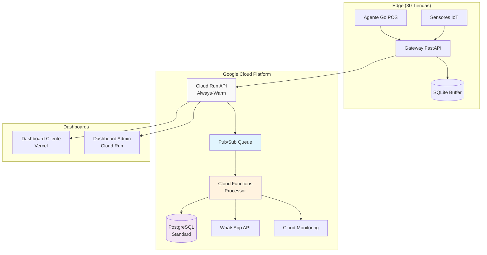
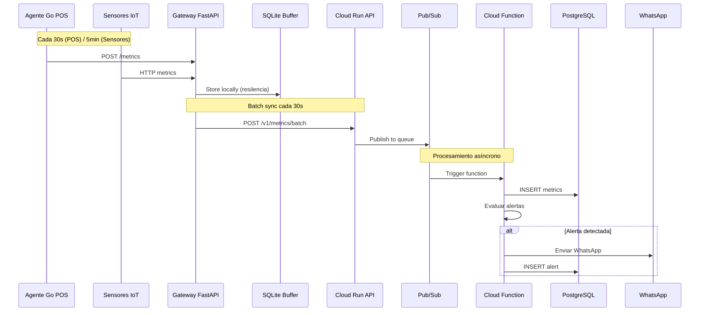
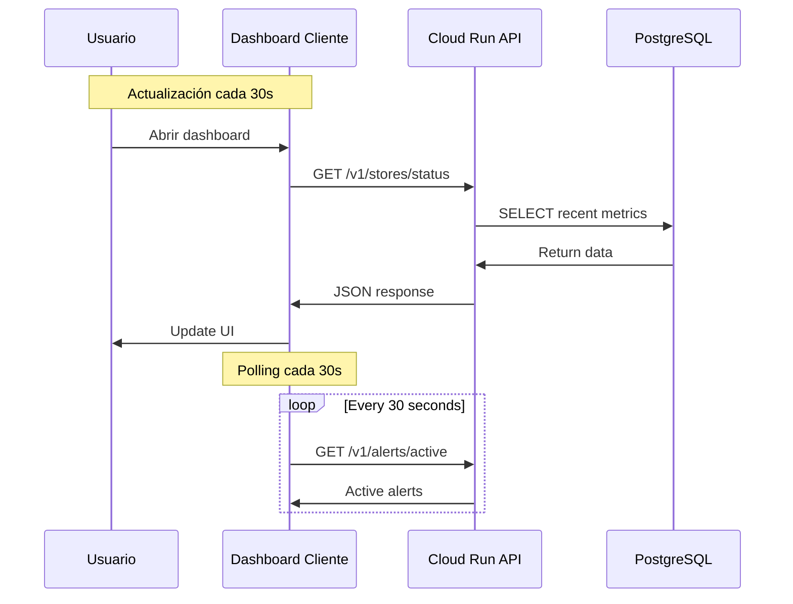

# StorePulse - Arquitectura General del Sistema

## 1. Visión General

StorePulse implementa una arquitectura distribuida hybrid serverless que combina edge computing para resiliencia local con procesamiento cloud eficiente. Diseñada para el MVP con **30 tiendas máximo**, **~150 terminales POS** y **~240 sensores ambientales**, procesando **~19.5K eventos/hora** con un presupuesto de **$265/mes**.

```
┌─────────────────────────────────────────────────────────┐
│                     CAPA PRESENTACIÓN                      │
│         [Dashboard Cliente] [Dashboard Admin]              │
└─────────────────────────────────────────────────────────┘
                            ↕
┌─────────────────────────────────────────────────────────┐
│                 CAPA CLOUD (GCP - Híbrido)                │
│   [Cloud Run Always-On] → [Pub/Sub] → [Cloud Functions]   │
│            [PostgreSQL Standard] → [Monitoring]           │
└─────────────────────────────────────────────────────────┘
                            ↕
┌─────────────────────────────────────────────────────────┐
│                      CAPA EDGE (Tienda)                    │
│   [Agentes Go POS] → [Gateway Python] → [SQLite Buffer]   │
└─────────────────────────────────────────────────────────┘
```

### Mermaid: Arquitectura Cloud Simplificada



## 2. Principios de Diseño MVP

### 2.1 Simplicidad y Rapidez de Desarrollo
- **Arquitectura Híbrida:** Cloud Run always-warm para latencia + Cloud Functions para procesamiento
- **Stack Conocido:** Go + Python + PostgreSQL estándar (sin extensiones)
- **Deployment Simple:** Docker containers y funciones serverless
- **Configuración Mínima:** Menos variables, menos complejidad

### 2.2 Resiliencia Edge-First
- **Operación Offline:** Cada tienda opera 4+ horas sin conexión
- **Buffer Local:** SQLite con 4+ horas de capacidad
- **Reintentos Inteligentes:** Exponential backoff para reconexión
- **Heartbeat Simple:** Detección de fallas en <1 minuto

### 2.3 Escalabilidad Controlada
- **Límite MVP:** 30 tiendas máximo, ~19.5K eventos/hora
- **Multitenancy:** Row Level Security por cliente
- **No Partitioning:** PostgreSQL estándar hasta 1M registros/mes
- **CDN Básico:** Vercel para dashboards cliente

### 2.4 Costo-Eficiencia
- **Serverless Inteligente:** Cloud Run always-warm evita cold starts
- **Sin Redis:** Caching en memoria de aplicación
- **Batch Sync:** Reduce llamadas API (30s intervals)
- **Presupuesto Target:** $265/mes por cliente

## 3. Componentes del Sistema

### 3.1 Capa Edge (Tienda)

#### 3.1.1 Agente POS
```go
// Tecnología: Go 1.21
// Deployment: Windows Service (.exe)
// Responsabilidades:
- Monitor de salud del POS
- Verificación de conectividad
- Estado de periféricos
- Envío de métricas al Gateway
```

**Estructura del Agente:**
```
pos-agent/
├── main.go              # Entry point
├── monitor/
│   ├── health.go        # Health checks
│   ├── network.go       # Network connectivity
│   └── peripherals.go   # Printer/scanner status
├── client/
│   └── gateway.go       # Gateway communication
└── config/
    └── config.yaml      # Configuration
```

#### 3.1.2 Gateway Local
```python
# Tecnología: Python 3.11 + FastAPI
# Deployment: Docker container o systemd service
# Responsabilidades:
- Agregación de métricas
- Buffer en SQLite
- Sincronización con cloud
- Gestión de comandos remotos
```

**Estructura del Gateway:**
```
gateway/
├── main.py              # FastAPI app
├── api/
│   ├── ingest.py       # Metric ingestion endpoints
│   ├── command.py      # Remote command endpoints
│   └── health.py       # Health check endpoints
├── sync/
│   ├── uploader.py     # Cloud sync service
│   └── scheduler.py    # Cron jobs
├── storage/
│   ├── models.py       # SQLAlchemy models
│   └── buffer.py       # Buffer management
└── config/
    └── settings.py     # Environment config
```

#### 3.1.3 Sensores IoT
```yaml
# Especificaciones:
Protocol: WiFi 802.11n
API: REST over HTTP
Power: Battery 2xAA (1-2 años)
Metrics:
  - temperature: -40 to 85°C (±0.5°C)
  - humidity: 0-100% RH (±3%)
  - battery: voltage level
Polling: Gateway queries every 5 minutes
```

### 3.2 Capa Cloud (Google Cloud Platform)

#### 3.2.1 API Gateway (Always-Warm Cloud Run)
```yaml
# Cloud Run API - Always Warm para <200ms latency
Service: storepulse-api
Memory: 1Gi
CPU: 1
Min instances: 1  # Always-warm para evitar cold starts
Max instances: 10 # Suficiente para 30 tiendas
Concurrency: 100
Timeout: 60s

Endpoints:
  POST /v1/metrics/batch     # Ingesta de métricas
  GET /v1/stores/{id}/status # Estado en tiempo real
  GET /v1/alerts/active      # Alertas activas
  GET /v1/health             # Health check

# Message Queue (Pub/Sub) - Simplificado
Topic: metrics-queue
Subscription: process-metrics
Message retention: 1 day    # Reducido para MVP
Ack deadline: 30 seconds
```

#### 3.2.2 Procesamiento Serverless
```yaml
# Cloud Functions - Simplificadas para MVP
process_metrics:
  trigger: Pub/Sub topic 'metrics-queue'
  memory: 512MB
  timeout: 60s
  max_instances: 20
  tasks:
    - Validar y parsear métricas
    - Insertar en PostgreSQL
    - Evaluar reglas de alerta básicas
    - Trigger alertas WhatsApp si necesario

generate_reports:
  trigger: Cloud Scheduler (daily at 6 AM)
  memory: 256MB
  timeout: 300s
  max_instances: 1
  tasks:
    - Generar reporte diario por tienda
    - Cleanup de datos antiguos (>1 año)
```

#### 3.2.3 Almacenamiento Simplificado
```sql
-- Cloud SQL PostgreSQL Standard (Sin partitioning para MVP)
-- Instance: db-custom-1-3840 (1 vCPU, 3.75GB RAM) - Optimizado costo

-- Esquema principal - SIN PARTICIONES para MVP
CREATE TABLE metrics (
    id BIGSERIAL PRIMARY KEY,
    tenant_id VARCHAR(50) NOT NULL,
    store_id VARCHAR(50) NOT NULL,
    device_type VARCHAR(20) NOT NULL, -- 'pos' | 'sensor'
    device_id VARCHAR(50) NOT NULL,
    metric_data JSONB NOT NULL,
    created_at TIMESTAMPTZ DEFAULT NOW(),
    processed_at TIMESTAMPTZ
);

-- Índices simples para MVP (30 tiendas, <1M registros/mes)
CREATE INDEX idx_tenant_store_time ON metrics(tenant_id, store_id, created_at DESC);
CREATE INDEX idx_recent_metrics ON metrics(created_at DESC) WHERE created_at > NOW() - INTERVAL '7 days';

-- Row Level Security para multitenancy
ALTER TABLE metrics ENABLE ROW LEVEL SECURITY;
CREATE POLICY tenant_isolation ON metrics
    FOR ALL TO storepulse_app
    USING (tenant_id = current_setting('app.tenant_id'));

-- Tabla de tenants (clientes)
CREATE TABLE tenants (
    tenant_id VARCHAR(50) PRIMARY KEY,
    company_name VARCHAR(100) NOT NULL,
    plan_type VARCHAR(20) DEFAULT 'basic',  -- 'basic', 'premium'
    max_stores INTEGER DEFAULT 30,
    max_monthly_cost DECIMAL(10,2) DEFAULT 265.00,
    created_at TIMESTAMPTZ DEFAULT NOW(),
    is_active BOOLEAN DEFAULT TRUE,
    
    -- Configuración por cliente
    config JSONB DEFAULT '{}',
    
    -- Para facturación y contacto
    billing_email VARCHAR(100),
    admin_contact VARCHAR(100),
    whatsapp_numbers JSONB DEFAULT '[]',  -- Números para alertas
    
    CONSTRAINT valid_plan CHECK (plan_type IN ('basic', 'premium'))
);

-- Datos ejemplo
INSERT INTO tenants VALUES 
('cliente1', 'Supermercados ABC', 'basic', 30, 265.00, NOW(), TRUE, 
 '{}', 'admin@abc.com', 'Juan Pérez', '["1234567890"]'),
('cliente2', 'Retail XYZ', 'basic', 25, 265.00, NOW(), TRUE, 
 '{}', 'ops@xyz.com', 'María López', '["0987654321"]');

-- Tabla de configuración por tienda
CREATE TABLE stores (
    tenant_id VARCHAR(50),
    store_id VARCHAR(50),
    store_name VARCHAR(100),
    config JSONB DEFAULT '{}',
    created_at TIMESTAMPTZ DEFAULT NOW(),
    is_active BOOLEAN DEFAULT TRUE,
    PRIMARY KEY (tenant_id, store_id),
    FOREIGN KEY (tenant_id) REFERENCES tenants(tenant_id)
);

-- API Keys por tienda (para gateways)
CREATE TABLE store_api_keys (
    key_id VARCHAR(64) PRIMARY KEY,  -- store_cliente1_T01_abc123
    tenant_id VARCHAR(50) NOT NULL,
    store_id VARCHAR(50) NOT NULL,
    key_hash VARCHAR(128) NOT NULL,  -- SHA-256 hash
    created_at TIMESTAMPTZ DEFAULT NOW(),
    last_used_at TIMESTAMPTZ,
    is_active BOOLEAN DEFAULT TRUE,
    
    FOREIGN KEY (tenant_id, store_id) REFERENCES stores(tenant_id, store_id)
);

CREATE INDEX idx_api_keys_lookup ON store_api_keys(key_hash) WHERE is_active = TRUE;

-- Tabla de alertas simplificada
CREATE TABLE alerts (
    id UUID PRIMARY KEY DEFAULT gen_random_uuid(),
    tenant_id VARCHAR(50),
    store_id VARCHAR(50),
    alert_type VARCHAR(50),
    severity VARCHAR(20), -- 'critical' | 'high' | 'medium' | 'low'
    message TEXT,
    details JSONB,
    created_at TIMESTAMPTZ DEFAULT NOW(),
    acknowledged_at TIMESTAMPTZ,
    resolved_at TIMESTAMPTZ
);
```

### 3.3 Capa de Presentación

#### 3.3.1 Dashboard Cliente
```javascript
// Stack: React 18 + Vite + TailwindCSS
// Hosting: Vercel (CDN global)
// Features:
- Real-time updates (30s polling)
- Responsive design
- Role-based access
- Export capabilities

// Estructura:
client-dashboard/
├── src/
│   ├── pages/
│   │   ├── Dashboard.jsx
│   │   ├── StoreDetail.jsx
│   │   └── Alerts.jsx
│   ├── components/
│   │   ├── MetricCard.jsx
│   │   ├── TemperatureChart.jsx
│   │   └── AlertList.jsx
│   ├── services/
│   │   └── api.js
│   └── utils/
│       └── constants.js
└── package.json
```

#### 3.3.2 Dashboard Administrador
```javascript
// Stack: React 18 + Material-UI
// Hosting: Cloud Run (acceso restringido)
// Features:
- Infrastructure monitoring
- Remote commands
- Configuration management
- Audit logs

// Endpoints especiales:
GET /api/admin/infrastructure
POST /api/admin/restart-sensor
GET /api/admin/logs
PUT /api/admin/config
```

## 4. Flujos de Datos Simplificados

### 4.1 Flujo Principal: Edge → Cloud (MVP)


### 4.2 Flujo de Dashboard (MVP)


## 5. Patrones Multi-Tenant

### 5.1 Tenant Context Pattern
Isolación automática por tenant:
```python
# API Middleware - Tenant Context
from fastapi import Request, HTTPException
from sqlalchemy import text

class TenantContextMiddleware:
    async def __call__(self, request: Request, call_next):
        # Extract tenant from API key
        api_key = request.headers.get("Authorization", "").replace("Bearer ", "")
        tenant_id = await self.get_tenant_from_key(api_key)
        
        if not tenant_id:
            raise HTTPException(401, "Invalid API key")
        
        # Set tenant context for RLS
        request.state.tenant_id = tenant_id
        
        # Set database session context
        async with database.begin() as conn:
            await conn.execute(text(f"SET app.tenant_id = '{tenant_id}'"))
            request.state.db_connection = conn
            
            response = await call_next(request)
            return response
    
    async def get_tenant_from_key(self, api_key: str) -> str:
        # Cache lookup first, then database
        return await self.key_cache.get(api_key)
```

### 5.2 Tenant Limits Pattern
Validación de límites por cliente:
```python
class TenantLimitsService:
    async def validate_store_limit(self, tenant_id: str):
        tenant = await self.get_tenant(tenant_id)
        current_stores = await self.count_active_stores(tenant_id)
        
        if current_stores >= tenant.max_stores:
            raise HTTPException(400, f"Store limit exceeded: {tenant.max_stores}")
    
    async def check_cost_limit(self, tenant_id: str) -> float:
        """Returns projected monthly cost"""
        tenant = await self.get_tenant(tenant_id)
        daily_cost = await self.get_daily_cost(tenant_id)  # GCP billing API
        projected = daily_cost * 30
        
        if projected > tenant.max_monthly_cost:
            await self.send_cost_alert(tenant_id, projected)
            
        return projected
```

### 5.3 Batch Sync Pattern (Multi-Tenant)
```python
# Gateway Local con tenant context
class BatchSyncService:
    def __init__(self, tenant_id: str, store_id: str, api_key: str):
        self.tenant_id = tenant_id
        self.store_id = store_id
        self.api_key = api_key
        self.batch_size = 50
        self.pending_metrics = []
    
    async def sync_batch(self):
        if len(self.pending_metrics) >= self.batch_size:
            # Add tenant context to payload
            payload = {
                'tenant_id': self.tenant_id,
                'store_id': self.store_id,
                'metrics': self.pending_metrics,
                'timestamp': datetime.utcnow().isoformat()
            }
            await self.send_to_cloud(payload)
            self.pending_metrics = []
```

### 5.2 Simple Retry Pattern
Reconexión con backoff:
```python
# Simplified retry for MVP
def simple_retry(func, max_attempts=3):
    for attempt in range(max_attempts):
        try:
            return func()
        except Exception as e:
            if attempt == max_attempts - 1:
                raise
            time.sleep(2 ** attempt)  # 1s, 2s, 4s
```

### 5.3 Alert Rules Engine (Simple)
Evaluación básica de umbrales:
```python
class SimpleAlertRules:
    RULES = {
        'pos_offline': {'threshold': 90, 'unit': 'seconds'},
        'temp_high_fridge': {'threshold': 8.0, 'unit': 'celsius'},
        'temp_high_freezer': {'threshold': -15.0, 'unit': 'celsius'}
    }
    
    def evaluate(self, metric_data):
        # Simple threshold checking
        for rule, config in self.RULES.items():
            if self._check_threshold(metric_data, rule, config):
                return self._create_alert(rule, metric_data)
```

## 6. Configuración y Deployment

### 6.1 Variables de Entorno Multi-Tenant
```bash
# Gateway Local (Docker) - Con tenant context
GATEWAY_PORT=8080
CLOUD_API_URL=https://ingest.storepulse.io  # Separada de query API
API_KEY=store_cliente1_T01_abc123def456     # Format: store_{tenant}_{store}_{random}
SQLITE_PATH=/data/buffer.db
SYNC_INTERVAL_SECONDS=30
BATCH_SIZE=50
STORE_ID=T01
TENANT_ID=cliente1                          # Redundante con API_KEY pero útil
LOG_LEVEL=INFO

# Validation
TENANT_MAX_STORES=30
TENANT_MAX_COST=265.00

# Cloud Run Ingest API
PORT=8080
DATABASE_URL=postgresql://user:pass@/storepulse?host=/cloudsql/instance
PUBSUB_TOPIC=projects/storepulse-prod/topics/metrics-queue
MAX_BATCH_SIZE=100
API_KEY_CACHE_TTL=300                       # 5 min cache for API key lookups
TENANT_LIMITS_CHECK_INTERVAL=3600           # Check limits hourly

# Cloud Run Query API (Dashboards)
PORT=8080
DATABASE_URL=postgresql://user:pass@/storepulse?host=/cloudsql/instance
JWT_SECRET_KEY=<jwt-secret-from-secret-manager>
JWT_ACCESS_TOKEN_EXPIRE_MINUTES=60
CORS_ORIGINS=["https://cliente1.storepulse.io","https://cliente2.storepulse.io"]

# Cloud Function (Multi-tenant processor)
PROJECT_ID=storepulse-prod
DATABASE_URL=postgresql://user:pass@/storepulse?host=/cloudsql/instance
WHATSAPP_API_URL=https://graph.facebook.com/v17.0
WHATSAPP_API_TOKEN=<business-api-token>
ALERT_COOLDOWN_MINUTES=5
MAX_ALERTS_PER_TENANT_HOUR=50               # Rate limiting por tenant
```

### 6.2 Docker Compose Simplificado (Gateway)
```yaml
version: '3.8'
services:
  gateway:
    image: storepulse/gateway:latest
    ports:
      - "8080:8080"
    volumes:
      - ./data:/data          # SQLite buffer storage
      - ./logs:/logs          # Local logs
    environment:
      - CLOUD_API_URL=${CLOUD_API_URL}
      - API_KEY=${API_KEY}
      - STORE_ID=${STORE_ID}
      - TENANT_ID=${TENANT_ID}
      - SYNC_INTERVAL_SECONDS=30
      - BATCH_SIZE=50
      - LOG_LEVEL=INFO
    restart: unless-stopped
    healthcheck:
      test: ["CMD", "curl", "-f", "http://localhost:8080/health"]
      interval: 30s
      timeout: 5s
      retries: 3
      start_period: 10s
```

### 6.3 Terraform MVP (Infraestructura Simplificada)
```hcl
# Cloud Run API (Always-Warm)
resource "google_cloud_run_service" "api" {
  name     = "storepulse-api"
  location = "us-central1"

  template {
    metadata {
      annotations = {
        "autoscaling.knative.dev/minScale" = "1"  # Always-warm
        "autoscaling.knative.dev/maxScale" = "10"
      }
    }
    
    spec {
      containers {
        image = "gcr.io/storepulse-prod/api:latest"
        resources {
          limits = {
            cpu    = "1"
            memory = "1Gi"
          }
        }
        
        env {
          name  = "PORT"
          value = "8080"
        }
      }
      
      container_concurrency = 100
      timeout_seconds = 60
    }
  }
}

# Cloud SQL Instance (Optimizado costo)
resource "google_sql_database_instance" "main" {
  name             = "storepulse-db"
  database_version = "POSTGRES_15"
  region           = "us-central1"

  settings {
    tier = "db-custom-1-3840"  # 1 vCPU, 3.75GB RAM
    
    backup_configuration {
      enabled    = true
      start_time = "03:00"
      location   = "us-central1"
    }
    
    database_flags {
      name  = "max_connections"
      value = "50"  # Reducido para MVP
    }
    
    disk_size = 20  # GB - Suficiente para MVP
    disk_type = "PD_SSD"
  }
}

# Cloud Function para procesamiento
resource "google_cloudfunctions2_function" "processor" {
  name        = "process-metrics"
  location    = "us-central1"
  description = "Process metrics and generate alerts"

  build_config {
    runtime     = "python311"
    entry_point = "process_metrics"
  }

  service_config {
    max_instance_count = 20
    available_memory   = "512M"
    timeout_seconds    = 60
  }

  event_trigger {
    trigger_region = "us-central1"
    event_type     = "google.cloud.pubsub.topic.v1.messagePublished"
    pubsub_topic   = google_pubsub_topic.metrics.id
  }
}
```
```

## 7. Monitoreo Simplificado MVP

### 7.1 Métricas Esenciales
```yaml
# Métricas de Sistema (Cloud Monitoring automático)
Infrastructure:
  - Cloud Run: Latency, Error Rate, Instance Count
  - Cloud SQL: CPU, Memory, Connections
  - Cloud Function: Execution Time, Error Rate
  
# Métricas de Negocio (Custom)
Business:
  - active_pos_count: Cuantos POS online ahora
  - stores_offline: Tiendas sin datos >5min
  - alerts_sent_today: WhatsApp enviados
  - temp_violations: Temperatura fuera de rango
  
# Presupuesto y Tráfico
Operational:
  - events_per_hour: ~650 por tienda (19.5K total)
  - cost_per_month: Target $265/mes
  - data_freshness: Última métrica recibida
```

### 7.2 Logging Básico
```python
# Formato estructurado simple
{
    "timestamp": "2025-01-15T10:30:00Z",
    "level": "INFO",
    "service": "gateway" | "api" | "processor",
    "tenant_id": "cliente1",
    "store_id": "T01",
    "event": "metrics_synced" | "alert_sent" | "error",
    "details": {
        "batch_size": 45,
        "duration_ms": 180
    }
}
```

### 7.3 Alertas de Sistema
```yaml
# Solo alertas críticas para MVP
System Alerts:
  - api_down: Cloud Run no responde >2min
  - database_down: Connection pool agotado
  - high_error_rate: >5% errores en 10min
  - cost_spike: >$300 proyectado mes
```

## 8. Resiliencia MVP

### 8.1 Estrategia de Backup Simple
- **Database:** Cloud SQL backup diario automático (7 días retención)
- **Código:** Git + GitHub (versionado completo)
- **Configuración:** Terraform state en Cloud Storage
- **Buffer Local:** 4+ horas de datos en SQLite

### 8.2 RTO/RPO MVP
- **RTO (Recovery Time):** 2 horas (manual recovery aceptable)
- **RPO (Recovery Point):** 30 segundos (batch sync interval)
- **Uptime Target:** 99.5% (4+ horas downtime/mes aceptable)

### 8.3 Failure Modes
```yaml
Cloud API Down:
  - Gateway continúa con buffer local
  - Resync automático al restaurar
  
Database Down:
  - Cloud SQL HA automático
  - Recovery manual si es necesario
  
Gateway Down:
  - Restart automático (Docker)
  - Pérdida <4h de datos (buffer)
  
Sensor/POS Down:
  - Alert WhatsApp inmediato
  - No impacta otros dispositivos
```

## 9. Estimaciones de Tráfico y Costo

### 9.1 Cálculo de Eventos (30 Tiendas)
```yaml
POS Terminals: 150 terminals
  - Frecuencia: cada 30s
  - Eventos/hora: 150 × 120 = 18,000/hora
  
Sensores Ambientales: 240 sensores  
  - Frecuencia: cada 5min (12 por hora)
  - Eventos/hora: 240 × 12 = 2,880/hora
  
Total: ~20,880 eventos/hora (pico)
Promedio: ~19,500 eventos/hora
Diario: ~468,000 eventos
Mensual: ~14M eventos
```

### 9.2 Costos Estimados GCP
```yaml
# Infraestructura Core
Cloud Run API (always-warm):
  - 1 instancia mínima: $15/mes
  - Tráfico 20K req/hora: $45/mes
  - Total: $60/mes
  
Cloud SQL (custom-1-3840):
  - Instancia: $65/mes
  - Storage 20GB: $3/mes
  - Total: $68/mes
  
Cloud Functions:
  - 1.4M invocaciones/mes: $20/mes
  - Compute time: $25/mes
  - Total: $45/mes
  
Pub/Sub:
  - 14M mensajes/mes: $15/mes
  
Networking + Monitoring: $30/mes

Cost per client: ~$218/mes
Buffer (15%): ~$47/mes
Total: ~$265/mes ✅
```

### 9.3 Proyección de Crecimiento
```yaml
# Capacidad máxima sin rediseño
Max Stores: 50 tiendas (vs 30 MVP)
Max Events: ~32K eventos/hora  
Max Monthly: ~23M eventos
Max Cost: ~$400/mes

# Puntos de escalabilidad
Database: Upgrade a db-n1-standard-1 ($120/mes)
API: Autoescala a 3 instancias
Functions: Autoescala a 50 instancias
```

---
*Arquitectura StorePulse MVP v2.0*
*Stack: Go + Python + Cloud Run + Cloud Functions + PostgreSQL*
*Escala: 30 tiendas, 19.5K eventos/hora, $265/mes*
*Última actualización: Enero 2025*